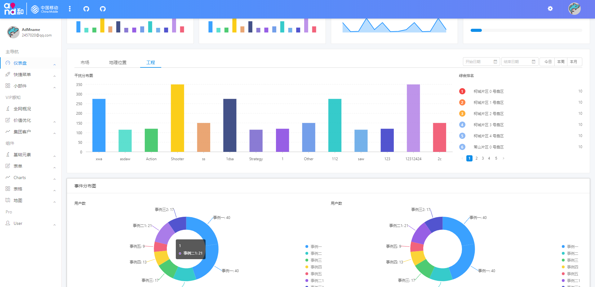
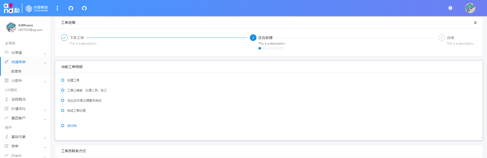
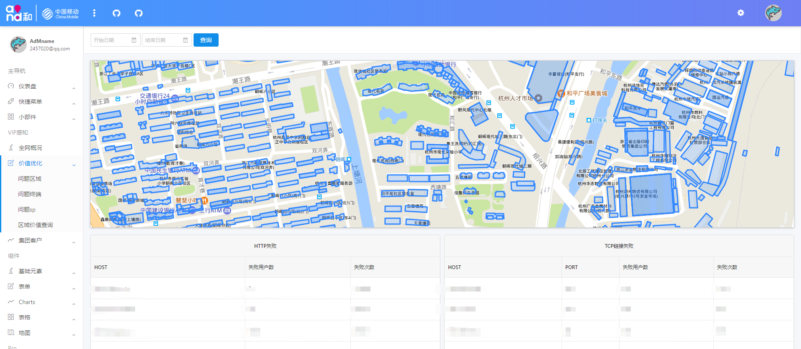
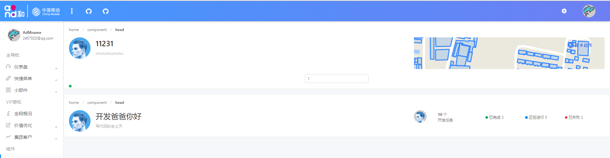
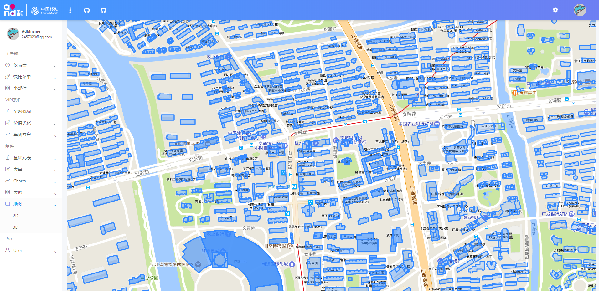

# Nb

一个大数据可视化的后台开发框架

## 特性

- 基于ant design 的视觉效果
- 使用开箱即用的Angular 脚手架
- 使用TypeScript 进行项目构建

## 支持的环境
- 最新版本的chrome以及firefox

## 构建

使用 `npm run s` 或者 Angular 脚手架中 `ng serve` 
## 技术栈
- Angular cli
- Angular
- Typescript
- leaflet
- Alibaba  G2
- ng-zorro-antd
- Rxjs
- font-awesome

## 截图

